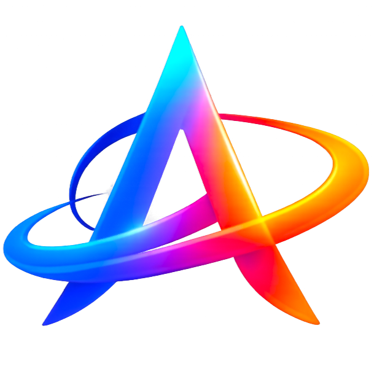

# Welcome to Lumina.

	

Lumina is an open-source AI-powered code editor by [Neuronal](https://neuronal.ai).

Use AI agents on your codebase, checkpoint and visualize changes, and bring any model or host locally. Lumina sends messages directly to providers without retaining your data.

This repo contains the full source code for Lumina. If you're new, welcome!

- 🧭 [Website](https://neuronal.ai)
- 👋 Discord (coming soon)
- 🚙 [Issues](https://github.com/lumina-ide/lumina/issues)

## Reference

Lumina is a fork of [Void](https://github.com/voideditor/void), which is itself a fork of [vscode](https://github.com/microsoft/vscode).

For a guide to the codebase, see [LUMINA_CODEBASE_GUIDE](./LUMINA_CODEBASE_GUIDE.md).

For build instructions, see [BUILDING](./BUILDING.md).

## Support

Contact us via email: hello@neuronal.ai
